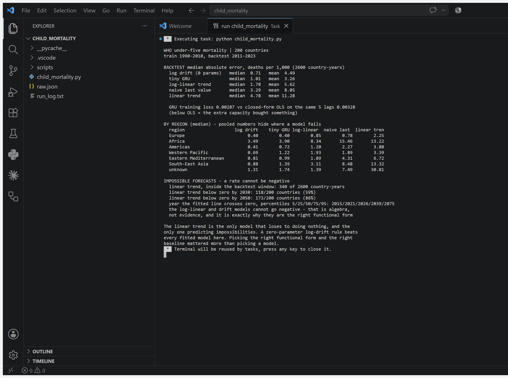

# Child Mortality — the model that predicted negative deaths 👶

**A fitted straight line forecasts *below zero* for 59% of countries by 2030 —
and it was already impossible 340 times inside the backtest window.** No error
metric checks whether a forecast can exist.

| Model | Median error | Mean error |
|---|---|---|
| **log drift — zero parameters** | **0.71** | 4.49 |
| tiny GRU | 1.01 | **3.26** |
| log-linear trend | 1.78 | 5.62 |
| naive last value | 3.29 | 8.05 |
| linear trend | 4.78 | 11.28 |

Deaths per 1,000 live births, 2,600 country-years. A rule with **no parameters**
— carry the last value forward at its recent geometric rate of decline — beats
every fitted model on median error, including the neural network.

## The problem

WHO Global Health Observatory `MDG_0000000007`: under-five mortality for 200
countries, 1990–2023. Child mortality has more than halved since 1990 and the
SDG target lands in 2030, so extrapolating the decline is a live policy
question. Train on 1990–2010, forecast 2011–2023.

## A rate cannot be negative

Under-five mortality is deaths per 1,000 live births. It has a floor at zero,
and the decline in most countries is roughly exponential. Fit a **straight
line** to that and the line keeps going down past zero:

```
linear trend, inside the backtest window:  340 of 2600 country-years
below zero by 2030:                        118/200 countries (59%)
below zero by 2050:                        173/200 countries (86%)
year the line crosses zero (percentiles)   5th 2015 · 50th 2026 · 95th 2075
```

The median country's fitted line goes impossible in **2026**. This is not an
exotic long-horizon artifact — a third of the impossible forecasts happen inside
the period the model was evaluated on, and the evaluation said nothing, because
MAE has no concept of a value that cannot exist.

Fitting the same decline on a log scale removes the problem **by construction**:
an exponential approaches zero without crossing it. That is algebra rather than
evidence — which is exactly the point. The functional form was the decision that
mattered, and it was made before any model was trained.

## The baseline that beat the neural network

The first version of this repo compared the GRU against a naive "last value
carried forward" — a random walk with **no drift**, on a series that declines
every year. That baseline cannot compete by construction, and it flattered
everything above it.

The honest baseline is a random walk *with* drift: take the last observed value
and carry it forward at the geometric rate of decline over the previous five
years. Zero parameters, no fitting, six lines of code. It wins: **0.71 vs 1.01**
for the GRU.

The GRU is not useless — it has the best **mean** error (3.26 vs 4.49), because
the drift rule blows up on erratic high-mortality series. The defensible claim is
that the network buys robustness in the tail, not median accuracy.

## Where the pooled number hides things

Median absolute error by WHO region:

| region | log drift | tiny GRU | log-linear | naive | linear |
|---|---|---|---|---|---|
| Europe | 0.40 | 0.40 | 0.85 | 0.78 | 2.25 |
| **Africa** | **3.49** | **3.90** | 8.34 | 15.46 | 13.22 |
| Americas | 0.41 | 0.72 | 1.20 | 2.27 | 3.80 |
| Western Pacific | 0.69 | 1.22 | 1.93 | 1.89 | 3.39 |
| E. Mediterranean | 0.81 | 0.99 | 1.89 | 4.31 | 6.72 |
| South-East Asia | 0.88 | 1.39 | 3.11 | 8.48 | 13.32 |

Africa carries errors an order of magnitude above Europe, and it is the region a
policy reader actually cares about. A pooled "1.01 deaths per 1,000" is dominated
by Europe and the Americas, where the problem is largely solved.

## Run it

```bash
pip install torch
curl -o raw.json "https://ghoapi.azureedge.net/api/MDG_0000000007"
python child_mortality.py
```

stdlib + PyTorch, CPU, a few minutes (the GRU trains for 3,000 epochs). Seed 42.
Full output in [`run_log.txt`](run_log.txt); the run captured live in VS Code:



## What the audit caught before publication

This is the first project run through the
[evaluation auditor](https://github.com/sravanni369/fizzbuzz-evaluation-traps)
*before* shipping rather than after. It rejected the first draft:

- **The headline was wrong.** The draft claimed "every model passed the
  backtest." The linear trend lost to doing nothing *and* produced 340
  impossible forecasts inside the evaluated window. The corrected version is a
  stronger claim.
- **The baseline was too weak** — no-drift random walk on a declining series.
  Adding the drift baseline demoted the GRU from best to second.
- **The GRU was not converged.** At 300 epochs its training loss (0.0040) was
  *worse* than closed-form OLS on its own five inputs (0.0033), and its backtest
  error was 1.51. At 3,000 epochs: 0.0029 and 1.01. The script now prints the
  OLS reference next to the GRU loss so "converged" is checkable rather than
  asserted.
- **One reported finding was a tautology** — counting negative forecasts from a
  log-scale model, which cannot produce one. Replaced with the zero-crossing
  distribution.
- **Pooled errors hid a region.** At 300 epochs the GRU was beaten in the
  Western Pacific by doing nothing. Convergence fixed it, but only stratifying
  revealed it.

## Honest scope

These are **UN IGME modelled estimates, not counted deaths** — a smooth curve
already fitted through sparse survey data. A log-linear fit gets median R² 0.97
on the training window, so a good score here partly measures agreement with
IGME's own smoother rather than demographic reality. Some series carry visible
artifacts: South Sudan repeats an identical value for 2019–2023. Country-level
rates say nothing about any individual child, and national aggregates hide
within-country inequality — the WHO data has wealth-quintile strata this project
does not use. Nothing here is a health projection.

**Sources:** WHO GHO indicator `MDG_0000000007` (accessed 4 Aug 2026). GRU —
[Dive into Deep Learning](https://d2l.ai) ch. 9; regression and backtesting —
[ISLP](https://www.statlearning.com) ch. 3. Adapted, not transcribed.
